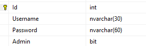
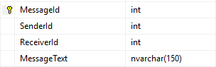
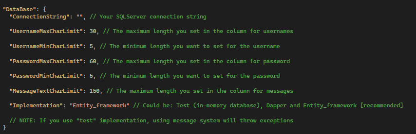
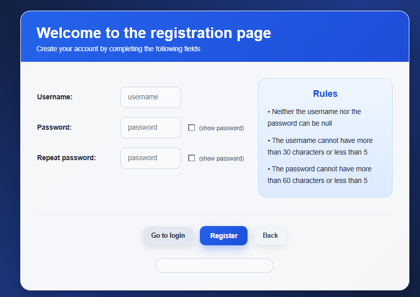
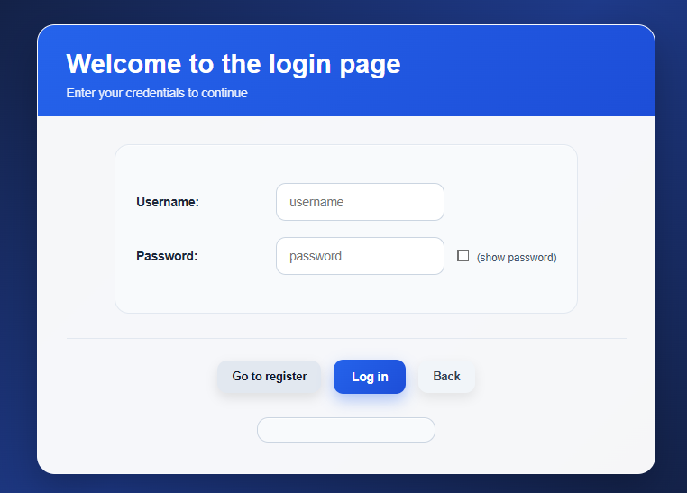
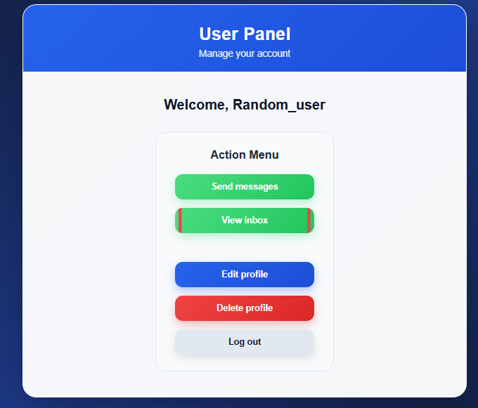
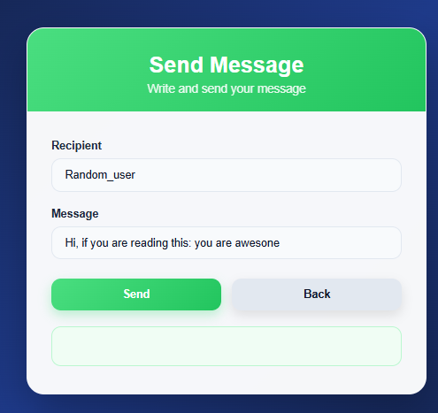
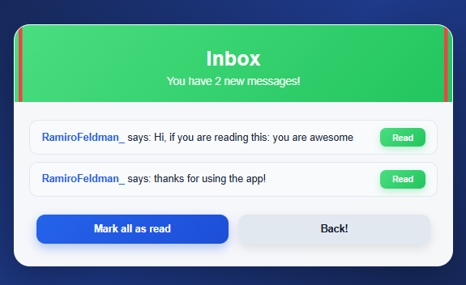

# Socialweb simulator

A Blazor Server social web **prototype** made as a warm-up project after a long time without coding. It features a user system with registration and authentication, a messaging system between users, and a layered architecture with swappable repository implementations.
## Tech Stack

- **C# / .NET 10**
- **ASP.NET Blazor Server**
- **Microsoft Entity Framework Core**
- **Dapper micro-ORM**
- **Microsoft SQL Server**
## Architecture
**User system and Message System have the same layers**

- **Model — domain entities (User, Message)**

- **Repositories — data access through interfaces with swappable implementations (EF Core, Dapper, in-memory for testing)** 

- **Services — business logic (registration, authentication, profile management, messaging)**

**Note:** The repository implementation and its configuration can be swapped from appsettings.json without touching the backend code.
## How to Run

Must have:
-  .NET SDK  | https://dotnet.microsoft.com/en-us/download
- SQL Server | https://www.microsoft.com/en-us/sql-server/sql-server-downloads

1. Create a DataBase in SQL server

2. Create a table in the SQL Server database with the following columns: INT PRIMARY KEY '"Id", NVARCHAR(x) Username, NVARCHAR(x) Password, BIT Admin -> none can be nullable



You can use the following sql command to create it:

````SQL
USE [your database name];

CREATE TABLE Users (
    Id INT PRIMARY KEY,
    Username NVARCHAR(30) NOT NULL,
    Password NVARCHAR(60) NOT NULL,
    Admin BIT NOT NULL DEFAULT 0
);
````


3. Create a table in the SQL Server database with the following columns: INT PRIMARY KEY MessageId, INT SenderId, INT ReceiverId, NVARCHAR(x) MessageText -> none can be nullable



you can use the following sql command to create it:

````SQL
USE [your database name];

CREATE TABLE MessageContainer (
    MessageId INT PRIMARY KEY,
    SenderId INT NOT NULL,
    ReceiverId INT NOT NULL,
    MessageText NVARCHAR(150) NOT NULL
);
````

4. In the Appsettings.json file establish the ConnectionString to your database (with the tables created) | https://stackoverflow.com/questions/10479763/how-to-get-the-connection-string-from-a-database


## Features

- **Registration, authentication and management of users with persistence**




- **Send and receive messages to/from other real users**



## Disclaimer

This project is a **proof of concept** and **is not intended for production use**. Its purpose is to demonstrate swappable repository implementations (Entity Framework Core, Dapper, in-memory) and the coexistence of two independent systems (User and Messaging) within a layered architecture. As a prototype, it does not implement production-grade security measures such as password hashing or token-based authentication.
